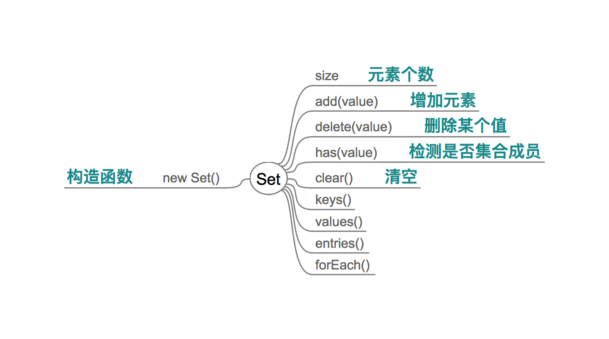
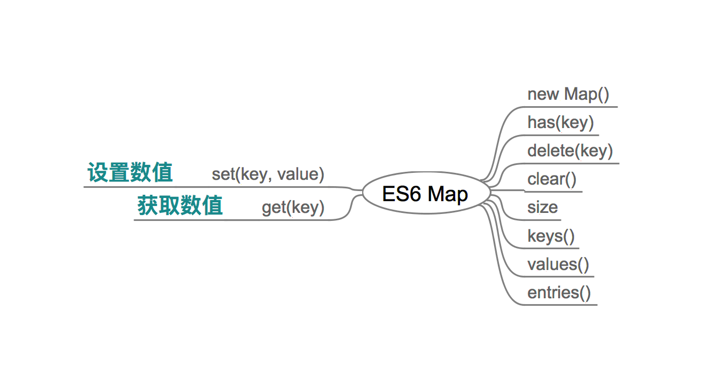

# Set 和 Map

简单来讲,  Set 是去重的数组，Map 是增强版的 Object。

## Set（集合）

ES6 提供了新的数据结构 Set。它类似于数组，但是**成员的值都是唯一的，没有重复的值**。相当于数学中的集合。

Set 本身是一个构造函数，用来生成 Set 数据结构。

```js
const s = new Set();

s.add(1)
s.add(2)
s.add(3)
s.add(1)

for (let i of s) {
  console.log(i);
}
// 1 2 3
```

上面代码通过 `add` 方法向 Set 结构加入成员，结果表明 Set 结构不会添加重复的值。

Set 函数可以接受一个数组（或者具有 iterable 接口的其他数据结构）作为参数，用来初始化。

```js
const set = new Set([1, 2, 3, 4, 4])
console.log(set) // Set(4) {1, 2, 3, 4}
console.log(set.size) // 4
```

**向 Set 加入值的时候，不会发生类型转换**，所以 5 和 "5" 是两个不同的值。

两个对象总是不相等的。



### 属性和方法

- Set.prototype.constructor
- Set.prototype.size
- add(value) 增加某个值，返回 Set 结构本身
- delete(value)
- has(value)
- clear()

```js
s.add(1).add(2).add(2) // 链式添加元素
```

### 遍历操作

- keys()
- values() 与 keys() 返回值完全相同
- entries()
- forEach() 与数组遍历完全一致

### 集合操作

使用 Set 可以很容易地实现并集（Union）、交集（Intersect）和差集（Difference）。

```js
let a = new Set([1, 2, 3]);
let b = new Set([4, 3, 2]);

// 并集
let union = new Set([...a, ...b]);
// set {1, 2, 3, 4}

// 交集
let intersect = new Set([...a].filter(x => b.has(x)));
// set {2, 3}

// 差集
let difference = new Set([...a].filter(x => !b.has(x)));
// set {1}
```

### 用途

去除数组重复成员

```js
[...new Set(array)]
```

### WeakSet

WeakSet 结构与 Set 类似，也是不重复的值的集合。但是，它与 Set 有两个区别。

首先，WeakSet 的成员只能是对象，而不能是其他类型的值。

```js
const ws = new WeakSet();
ws.add(1)
// TypeError: Invalid value used in weak set
ws.add(Symbol())
// TypeError: invalid value used in weak set
```

上面代码试图向 WeakSet 添加一个数值和 Symbol 值，结果报错，因为 WeakSet 只能放置对象。

其次，WeakSet 中的对象都是弱引用，即垃圾回收机制不考虑 WeakSet 对该对象的引用。

因此，WeakSet 适合临时存放一组对象，以及存放跟对象绑定的信息。只要这些对象在外部消失，它在 WeakSet 里面的引用就会自动消失。ES6 规定 WeakSet 不可遍历。

## Map



JavaScript 的对象（Object），本质上是键值对的集合（Hash 结构），但是传统上只能用字符串当作键。这给它的使用带来了很大的限制。

```js
const data = {};
const element = document.getElementById('myDiv');

data[element] = 'metadata';
data['[object HTMLDivElement]'] // "metadata"
```

上面代码原意是将一个 DOM 节点作为对象 data 的键，但是由于对象只接受字符串作为键名，所以element 被自动转为字符串 `[object HTMLDivElement]`。

为了解决这个问题，ES6 提供了 Map 数据结构。它类似于对象，也是键值对的集合，但是“键”的范围不限于字符串，各种类型的值（包括对象）都可以当作键。

```js
const m = new Map();
const o = {p: 'Hello World'};

m.set(o, 'content')
m.get(o) // "content"

m.has(o) // true
m.delete(o) // true
m.has(o) // false
```

Map 的键实际上是跟内存地址绑定的，只要内存地址不一样，就视为两个键。这就解决了同名属性碰撞（clash）的问题，我们扩展别人的库的时候，如果使用对象作为键名，就不用担心自己的属性与原作者的属性同名。

## WeakMap

一个典型应用场景是，在网页的 DOM 元素上添加数据，就可以使用 WeakMap 结构。当该 DOM 元素被清除，其所对应的 WeakMap 记录就会自动被移除。

```js
const wm = new WeakMap();

const element = document.getElementById('example');

wm.set(element, 'some information');
wm.get(element) // "some information"
```

总之，WeakMap 的专用场合就是，它的键所对应的对象，可能会在将来消失。**`WeakMap` 结构有助于防止内存泄漏**。

WeakMap 只有四个方法可用：`get()`、`set()`、`has()`、`delete()`。

> 是因为功能少，所以才叫 `弱Map` 么？

## References
- [Set 和 Map 数据结构](http://es6.ruanyifeng.com/#docs/set-map) - 阮一峰