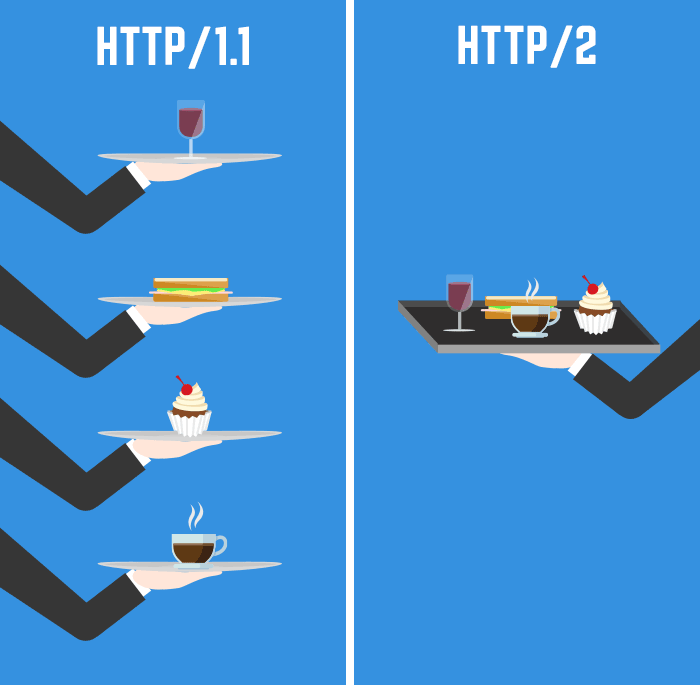

# Module 模块化


现实世界的模块化成功案例：乐高积木、活字印刷...

模块化的好处：提高复用性，提升效率，降低开发难度等。

## 关键词

`import`, `export`, `default`, `as`

## 背景

在 ES6 之前，社区制定了一些模块加载方案，最主要的有 `CommonJS` 和 `AMD` 两种。前者用于服务器，后者用于浏览器。ES6 在语言标准的层面上，实现了模块功能，而且实现得相当简单，完全可以取代 `CommonJS` 和 `AMD` 规范，成为浏览器和服务器通用的模块解决方案。

> `commonJS` 是 2009 年 Mozilla 工程师 Kevin Dangoor 创建的社区组织，制定了很多规范，比如 `Promise/A`、`Modules` 等。CommonJS 最著名的实现是 Node.js。不隶属于 Ecma International TC39 委员会，但是有些 TC39 成员也会参与其中。

ES6 模块的设计思想，是尽量的静态化，使得编译时就能确定模块的依赖关系，以及输入和输出的变量。

ES6 模块有以下好处：

- 不再需要 UMD 模块格式了，将来服务器和浏览器都会支持 ES6 模块格式。目前，通过各种工具库，其实已经做到了这一点。
- 将来浏览器的新 API 就能用模块格式提供，不再必须做成全局变量或者 `navigator` 对象的属性。
- 不再需要对象作为命名空间（比如Math对象），未来这些功能可以通过模块提供。

## 严格模式

ES6 的模块自动采用严格模式，不管你有没有在模块头部加上 `"use strict";`。

## export 命令

模块功能主要由两个命令构成：`export` 和 `import`。`export` 命令用于规定模块的对外接口，`import` 命令用于输入其他模块提供的功能。

```javascript
export const firstName = 'Michael';
export const lastName = 'Jackson';
export const year = 1958;
```

export的写法，除了像上面这样，还有另外一种。

```javascript
var firstName = 'Michael';
var lastName = 'Jackson';
var year = 1958;

export {firstName, lastName, year};
```

应该优先考虑使用这种写法。因为这样就可以在脚本尾部，一眼看清楚输出了哪些变量。

## 动态绑定

`export` 语句输出的接口，与其对应的值是动态绑定关系，即通过该接口，可以取到模块内部实时的值。

```javascript
export var foo = 'bar';
setTimeout(() => foo = 'baz', 500);
```

上面代码输出变量 `foo`，值为 `bar`，500毫秒之后变成 `baz`。

这一点与 CommonJS 规范完全不同。**CommonJS 模块输出的是值的缓存**，不存在动态更新

## import 命令

使用 `export` 命令定义了模块的对外接口以后，其他 JS 文件就可以通过 `import` 命令加载这个模块。

```javascript
import {firstName, lastName, year} from './profile';

function setName(element) {
  element.textContent = firstName + ' ' + lastName;
}
```

如果想为输入的变量重新取一个名字，import 命令要使用 `as` 关键字，将输入的变量重命名。

```javascript
import { lastName as surname } from './profile';
```

import语句会执行所加载的模块，因此可以有下面的写法。

```javascript
import 'lodash';
```

上面代码仅仅执行 `lodash` 模块，但是不输入任何值。

如果多次重复执行同一句 `import` 语句，那么只会执行一次，而不会执行多次。

```javascript
import 'lodash';
import 'lodash';
```

上面代码加载了两次 `lodash`，但是只会执行一次。

```javascript
import { foo } from 'my_module';
import { bar } from 'my_module';

// 等同于
import { foo, bar } from 'my_module';
```

上面代码中，虽然 `foo` 和 `bar` 在两个语句中加载，但是它们对应的是同一个 `my_module` 实例。也就是说，`import` 语句是 `Singleton` 模式。

## export default 命令

从前面的例子可以看出，使用import命令的时候，用户需要知道所要加载的变量名或函数名，否则无法加载。但是，用户肯定希望快速上手，未必愿意阅读文档，去了解模块有哪些属性和方法。

为了给用户提供方便，让他们不用阅读文档就能加载模块，就要用到 `export default` 命令，为模块指定默认输出。

```javascript
// export-default.js
export default function () {
  console.log('foo');
}
```

上面代码是一个模块文件 `export-default.js`，它的默认输出是一个函数。

其他模块加载该模块时，import命令可以为该匿名函数指定任意名字。

```javascript
// import-default.js
import customName from './export-default';
customName(); // 'foo'
```

上面代码的 `import` 命令，可以用任意名称指向 `export-default.js` 输出的方法，这时就不需要知道原模块输出的函数名。需要注意的是，**这时 `import` 命令后面，不使用大括号**。

显然，一个模块只能有一个默认输出，因此 `export default` 命令只能使用一次。

## 原生的模块化支持

2017年9月15日，Chrome 61 开始支持原生的 ES6 模块，只需使用 `<script type="module">` 嵌入即可。

```html
<script type="module">
  import {addText} from './utils.js';
  addText('Modules are pretty cool.');
</script>
```

```javascript
// utils.js
export function addTextToBody(text) {
  const div = document.createElement('div');
  div.textContent = text;
  document.body.appendChild(div);
}
```

`nomodule` 属性可以用作后向兼容性。

默认自带 `defer` 属性。内联脚本模块也是延迟执行。

模块只执行一次。

```html
<script nomodule src="fallback.js"></script>
```

[Live Demo](https://liuzhuan.github.io/test/native-es6-module/index.html)

Node.js 8.5.0 开始支持原生的 ES6 模块，不过需要使用 `--experimental-modules`，并且文件后缀必须是 `.mjs`。目前的计划是到 Node.js 10 LTS 才将默认值改为 ES 模块。

## HTTP/2



### 多工

HTTP/2 复用 TCP 连接，在一个连接里，客户端和浏览器都可以同时发送多个请求或回应。

这样双向的、实时的通信，就叫做多工（Multiplexing）。

### 服务器推送

HTTP/2 允许服务器未经请求，主动向客户端发送资源，这叫做服务器推送（server push）。

常见场景是客户端请求一个网页，这个网页里面包含很多静态资源。正常情况下，客户端必须收到网页后，解析 HTML 源码，发现有静态资源，再发出静态资源请求。其实，服务器可以预期到客户端请求网页后，很可能会再请求静态资源，所以就主动把这些静态资源随着网页一起发给客户端了。

## 参考文献
- [Module 的语法 - 阮一峰](http://es6.ruanyifeng.com/#docs/module)
- [ES6 Modules in Depth](https://ponyfoo.com/articles/es6-modules-in-depth) - Nicolás Bevacqua, 2015/09/25
- [New in Chrome 61](https://developers.google.com/web/updates/2017/09/nic61) - Pete LePage, 2017/09/15
- [ECMAScript modules in browsers](https://jakearchibald.com/2017/es-modules-in-browsers/) - Jake Archibald, 2017/05/02
- [Using ES modules natively in Node.js](http://2ality.com/2017/09/native-esm-node.html) - Dr. Axel Rauschmayer, 2017/09/12
- [HTTP 协议入门](http://www.ruanyifeng.com/blog/2016/08/http.html) - 阮一峰, 2016/08/19
- [CommonJS](https://www.wikiwand.com/en/CommonJS)
- [Kevin Dangoor](http://www.kevindangoor.com/)
- [CommonJS: JavaScript Standard Library](http://www.commonjs.org/)