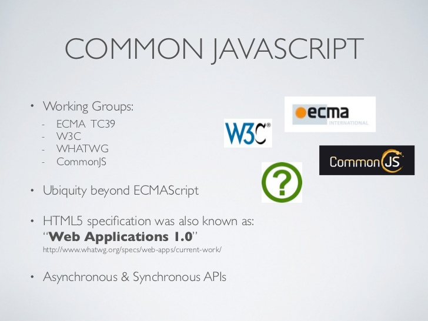

# Promise


## 关键词

`Promise`, `then`, `catch`

## 背景

常见的异步编程方案：回调函数和事件

### 回调函数

例如：微信 JSSDK 中判断当前客户端版本是否支持指定JS接口

```javascript
wx.checkJsApi({
  jsApiList: ['chooseImage'],
  success: function(res) {
    // do something
  },
  fail: function(err) {
    console.error(err);
  }
});
```

再如，Node.js 读取本地文件：

```javascript
fs.readFile('/etc/passwd', (err, data) => {
  if (err) throw err;
  console.log(data);
});
```


不规范；嵌套深代码难懂。

### 事件

```javascript
$('div').trigger('custom');
$('body').on('custom', (res) => {
    // do something...
})
```

[Live Demo](http://jsbin.com/cecerobici/edit?js,console)

事件顺序很重要；可以多次触发


类似叫号系统，必须先取号（注册监听函数），然后等待叫号（事件触发）。否则，就没法办理业务（事件处理函数）。

## 含义

Promise 是异步编程的一种解决方案，比传统的解决方案（回调函数和事件）更合理和更强大。它由社区最早提出和实现，ES6 将其写进语言标准，统一用法，原生提供 `Promise` 对象。

Promise 是一个容器，保存着某个未来才会结束的事件的结果。类似于彩票。


### `Promise/A+` 标准


Promise/A+ 规范规定了通用的 `.then()` 函数的行为。

## 两个特点

1. 状态不受外界影响。
2. 一旦状态改变，就不会再变。

## 三个状态

1. `pending`（进行中）未兑奖
2. `fulfilled`（已成功）已中奖
3. `rejected`（已失败）谢谢惠顾


## 优点

1. 避免层层嵌套（回调地狱）
2. 统一异步操作接口

## 缺点

1. 无法取消
2. 如果没有回调函数，内部错误无法抛出
3. 只能一次性，无法满足某些应用场景（比如监听下载进度）

## 基本用法

ES6 规定，`Promise` 对象是一个构造函数，用来生成 `Promise` 实例。

```javascript
const promise = new Promise((resolve, reject) => {
    // do something ...
    if (success) {
        resolve(value);
    } else {
        reject(error);
    }
});
```

`Promise` 构造函数接受一个函数作为参数，该函数的两个参数分别是 `resolve` 和 `reject`。它们是两个函数，由 JavaScript 引擎提供，不用自己部署。

`resolve` 函数的作用是，将 `Promise` 对象的状态从“未完成”变为“成功”（即从 `pending` 变为 `resolved`），在异步操作成功时调用，并将异步操作的结果，作为参数传递出去；`reject` 函数的作用是，将 `Promise` 对象的状态从“未完成”变为“失败”（即从 `pending` 变为 `rejected`），在异步操作失败时调用，并将异步操作报出的错误，作为参数传递出去。

Promise 实例生成以后，可以用 `then` 方法分别指定 `resolved` 状态和 `rejected` 状态的回调函数。

```javascript
promise.then(value => {
    // success
}, err => {
    // failure
})
```

`then` 方法可以接受两个回调函数作为参数。第一个回调函数是 `Promise` 对象的状态变为 `resolved` 时调用，第二个回调函数是 `Promise` 对象的状态变为 `rejected` 时调用。其中，第二个函数是可选的，不一定要提供。这两个函数都接受 `Promise` 对象传出的值作为参数。

下面是一个简单的 Promise 样例：

```javascript
{
  function timeout(ms) {
    return new Promise((resolve, reject) => {
      setTimeout(resolve, ms, 'done');
    });
  }

  timeout(100).then(value => {
    console.log(`value = ${value}`);
  })
}
```

Promise 新建后就会立即执行。

```javascript
{
  const promise = new Promise((resolve, reject) => {
    console.log('Promise'); // 1.
    resolve();
  });

  promise.then(function() {
    console.log('resolved.'); // 3.
  });

  console.log('Hi!'); // 2. 
}
```

下面是一个用 `Promise` 对象实现的 Ajax 操作的例子。

```javascript
function getJSON(url) {
  return new Promise((resolve, reject) => {
    const client = new XMLHttpRequest();
    client.open("GET", url);
    client.onreadystatechange = handler;
    client.responseType = "json";
    client.setRequestHeader("Accept", "application/json");
    client.send();

    function handler() {
      if (this.readyState !== 4) {
        return;
      }
      if (this.status === 200) {
        resolve(this.response);
      } else {
        reject(new Error(this.statusText));
      }
    };
  });
};

getJSON("/province.json")
  .then(
    json => {
      console.log('Contents: ', json);
    }, 
    err => {
      console.error('出错了', err);
    }
  );
```

## Promise.prototype.then()

`Promise` 实例具有 `then` 方法，也就是说，`then` 方法是定义在原型对象 `Promise.prototype` 上的。它的作用是为 `Promise` 实例添加状态改变时的回调函数。

`then` 方法返回的是一个新的 `Promise` 实例（注意，不是原来那个Promise实例）。因此可以采用链式写法，即 `then` 方法后面再调用另一个then方法。

```javascript
getJSON("/province.json").then(json => {
  return json.CN;
}).then(res => {
  // ...
});
```

采用链式的 `then`，可以指定一组按照次序调用的回调函数。这时，前一个回调函数，有可能返回的还是一个`Promise` 对象（即有异步操作），这时后一个回调函数，就会等待该 `Promise` 对象的状态发生变化，才会被调用。

```javascript
getJSON("/post/1.json").then(function(post) {
  return getJSON(post.commentURL);
}).then(function funcA(comments) {
  console.log("resolved: ", comments);
}, function funcB(err){
  console.log("rejected: ", err);
});
```

## Promise.prototype.catch()

`Promise.prototype.catch` 方法是 `.then(null, rejection)` 的别名，用于指定发生错误时的回调函数。

```javascript
getJSON('/posts.json')
  .then(posts => {
    // ...
  })
  .catch(error => {
    // 处理 getJSON 和前一个回调函数运行时发生的错误
    console.log('发生错误！', error);
  });
```

`Promise` 对象的错误具有“冒泡”性质，会一直向后传递，直到被捕获为止。

一般来说，不要在 `then` 方法里面定义 `Reject` 状态的回调函数（即then的第二个参数），总是使用`catch` 方法。

`catch` 方法返回的还是一个 Promise 对象，因此后面还可以接着调用 `then` 方法。

## Promise.all()

`Promise.all` 方法用于将多个 `Promise` 实例，包装成一个新的 `Promise` 实例。

```javascript
const p = Promise.all([p1, p2, p3]);
```

上面代码中，`Promise.all` 方法接受一个数组作为参数，`p1`、`p2`、`p3` 都是 `Promise` 实例，如果不是，就会先调用下面讲到的 `Promise.resolve` 方法，将参数转为 `Promise` 实例，再进一步处理。

```javascript
const databasePromise = connectDatabase();

const booksPromise = databasePromise
  .then(findAllBooks);

const userPromise = databasePromise
  .then(getCurrentUser);

Promise.all([
  booksPromise,
  userPromise
])
.then(([books, user]) => pickTopRecommentations(books, user));
```

## Promise.resolve()

Promise.resolve等价于下面的写法。

```javascript
Promise.resolve('foo')
// 等价于
new Promise(resolve => resolve('foo'))
```

## Promise.reject()

```javascript
var p = Promise.reject('出错了');
// 等同于
var p = new Promise((resolve, reject) => reject('出错了'))

p.then(null, function (s) {
  console.log(s)
});
```

## Promise 相关类库

### Axios

> Promise based HTTP client for the browser and node.js

[Axios@Github](https://github.com/mzabriskie/axios)

使用方法：

```javascript
// Make a request for a user with a given ID
axios.get('/user?ID=12345')
  .then(function (response) {
    console.log(response);
  })
  .catch(function (error) {
    console.log(error);
  });
```

发起 POST 请求：

```javascript
axios.post('/user', {
    firstName: 'Fred',
    lastName: 'Flintstone'
  })
  .then(function (response) {
    console.log(response);
  })
  .catch(function (error) {
    console.log(error);
  });
```

一个使用 axios [别人家的例子](https://github.com/superman66/vue-axios-github)

### whatwg-fetch

> A `window.fetch` JavaScript polyfill.

fetch 是用来代替 `XMLHttpRequest` 的方法。属于 Web Platform API，由 WHATWG 工作组指定规范。



[whatwg-fetch @ github](https://github.com/github/fetch)

使用方法如下：

```javascript
fetch(url, options).then(function(response) {
  // handle HTTP response
}, function(error) {
  // handle network error
})
```

比如，发送 POST 请求：

```javascript
fetch(url, {
  method: "POST",
  body: JSON.stringify(data),
  headers: {
    "Content-Type": "application/json"
  },
  credentials: "same-origin"
}).then(function(response) {
  response.status     //=> number 100–599
  response.statusText //=> String
  response.headers    //=> Headers
  response.url        //=> String

  return response.text()
}, function(error) {
  error.message //=> String
})
```

## jQuery 中的 Promise

jQuery 用 `$.Deferred` 实现了 Promise 规范。可以打印看看：

```javascript
var def = $.Deferred();
console.log(def);
```

`$.Deferred()` 返回一个对象，我们可以称之为 `Deferred` 对象，上面挂着一些熟悉的方法如：`done`、`fail`、`then`等。`jquery` 就是用这个 `Deferred` 对象来注册异步操作的回调函数，修改并传递异步操作的状态。

### `done` 与 `fail`

我们知道，`Promise` 规范中，`then` 方法接受两个参数，分别是执行完成和执行失败的回调，而 `jquery` 中进行了增强，还可以接受第三个参数，就是在 `pending` 状态时的回调，如下：

```javascript
deferred.then( doneFilter [, failFilter ] [, progressFilter ] )
```

除此之外，`jquery` 还增加了两个语法糖方法，`done` 和 `fail`，分别用来指定执行完成和执行失败的回调，也就是说这段代码：

```javascript
d.then(function(){
  console.log('执行完成');
}, function(){
  console.log('执行失败');
});
```

与这段代码是等价的：

```javascript
d.done(function(){
  console.log('执行完成');
})
.fail(function(){
  console.log('执行失败');
});
```

### `always`

`jquery` 的 `Deferred` 对象上还有一个 `always` 方法，不论执行完成还是执行失败，`always` 都会执行，有点类似 `ajax` 中的 `complete`。

### 总结

`$.Deferred` 实现了 `Promise` 规范，`then`、`done`、`fail`、`always`是 `Deferred` 对象的方法。`ajax` 返回一个 `Deferred` 对象，`success`、`error`、`complete` 是 `ajax` 提供的语法糖，功能与 `Deferred` 对象的 `done`、`fail`、`always` 一致

## 参考文献
- [Promise 对象](http://es6.ruanyifeng.com/#docs/promise) - 阮一峰
- [Promises for asynchronous programming - Exploring ES6](http://exploringjs.com/es6/ch_promises.html) - Axel Rauschmayer
- [Asynchronous programming (background) - Exploring ES6](http://exploringjs.com/es6/ch_async.html) - Axel Rauschmayer
- [Promise/A+](https://promisesaplus.com/)
- [Promise A+ 规范中文](http://malcolmyu.github.io/malnote/2015/06/12/Promises-A-Plus/) - 于明昊, 2015/06/12
- [大白话讲解Promise（一）](http://www.cnblogs.com/lvdabao/p/es6-promise-1.html) - 吕大豹, 2016/03/11
- [大白话讲解Promise（二）理解 Promise 规范](http://www.cnblogs.com/lvdabao/p/5320705.html) - 吕大豹, 2016/03/25
- [大白话讲解Promise（三）搞懂 jQuery 中的 Promise](http://www.cnblogs.com/lvdabao/p/jquery-deferred.html) - 吕大豹, 2016/03/29
- [Philip Roberts: Help, I'm stuck in an event-loop](https://vimeo.com/96425312) - Philip Roberts
- [ES6 Promises in Depth](https://ponyfoo.com/articles/es6-promises-in-depth) - Nicolás Bevacqua
- [Retiring vue-resource](https://medium.com/the-vue-point/retiring-vue-resource-871a82880af4) - Evan You
- [axios](https://github.com/mzabriskie/axios)
- [Promise](https://javascript.info/promise-basics) - Ilya Kantor