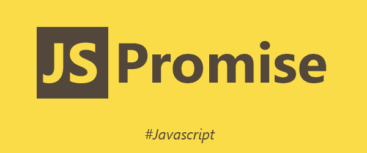
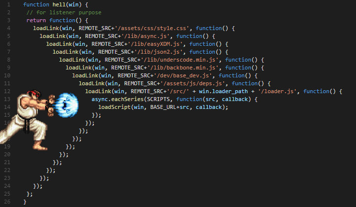

# Promise



## 关键词

`Promise`, `then`, `catch`

## 含义

Promise 是异步编程的一种解决方案，比传统的解决方案（回调函数和事件）更合理和更强大。它由社区最早提出和实现，ES6 将其写进语言标准，统一用法，原生提供 `Promise` 对象。

Promise 是一个容器，保存着某个未来才会结束的事件的结果。类似于彩票。


## 两个特点

1. 状态不受外界影响。
2. 一旦状态改变，就不会再变。

## 三个状态

1. `pending`（进行中）未兑奖
2. `fulfilled`（已成功）已中奖
3. `rejected`（已失败）谢谢惠顾

## 优点

1. 避免层层嵌套（回调地狱）
2. 统一异步操作接口



## 缺点

1. 无法取消
2. 如果没有回调函数，内部错误无法抛出
3. 只能一次性，无法满足某些应用场景（比如监听下载进度）

## 基本用法

ES6 规定，`Promise` 对象是一个构造函数，用来生成 `Promise` 实例。

```javascript
const promise = new Promise((resolve, reject) => {
    // do something ...
    if (success) {
        resolve(value);
    } else {
        reject(error);
    }
});
```

## 参考文献
- [Asynchronous programming (background) - Exploring ES6](http://exploringjs.com/es6/ch_async.html)
- [Philip Roberts: Help, I'm stuck in an event-loop](https://vimeo.com/96425312) - Vimeo
- [Promises for asynchronous programming - Exploring ES6](http://exploringjs.com/es6/ch_promises.html)
- [Promise 对象 - 阮一峰](http://es6.ruanyifeng.com/#docs/promise)
